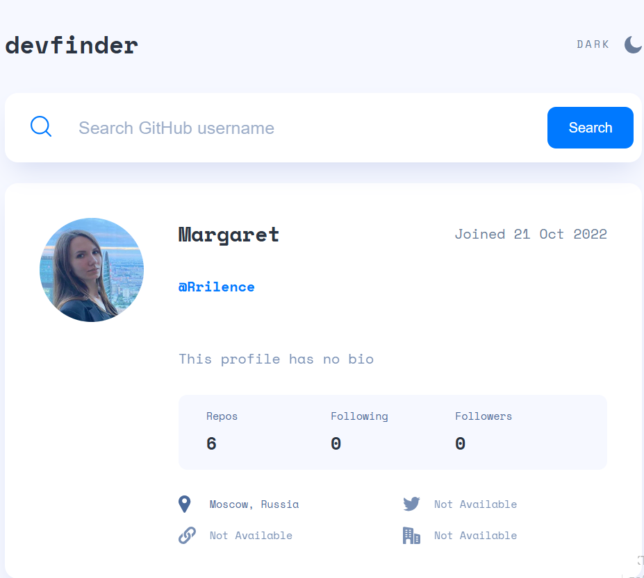
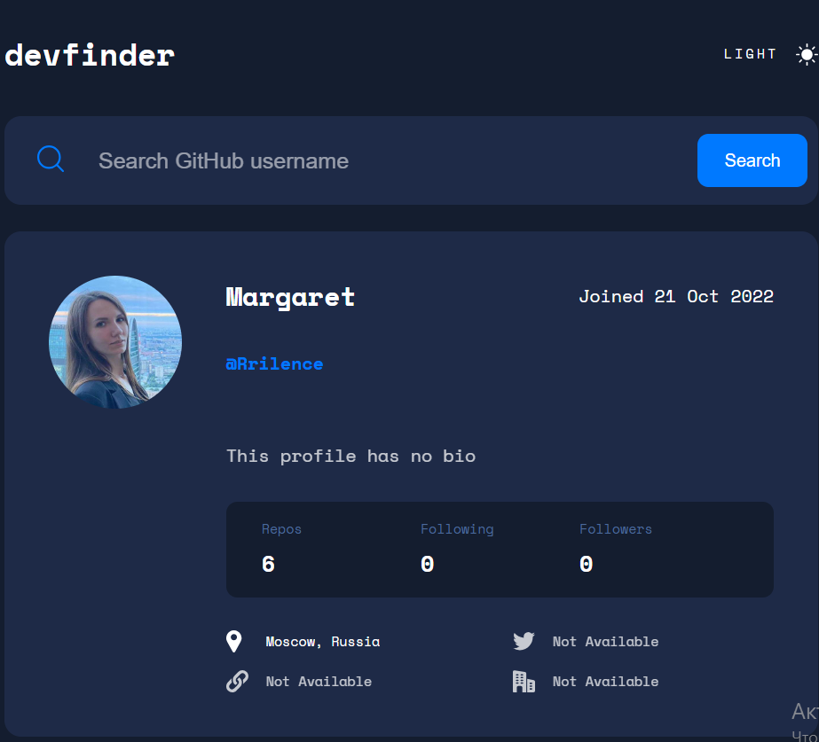
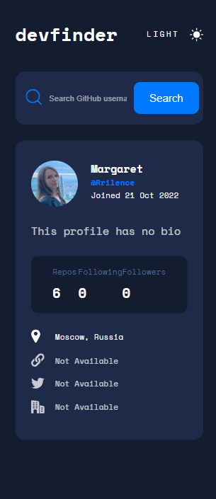
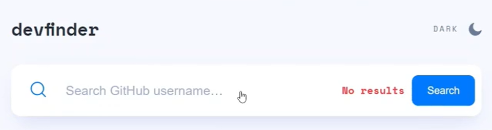

<h1 align="center">Devfinder</h1>

## Description

This project has written using React components and typed according to the TypeScript library. The project allows you to search for users registered on GitHub and see the main account parameters: username, location, number of projects, followers, etc..

## About the project.
- The markup is drawn dynamically using React components and typed according to the TypeScript.
- The data for the user's card is taken from an open Api of GitHub.

## Toggle light and dark theme.

## Adaptive design

The interface design is provided for various types of devices.

## **Mobile version. Search default user**

## **Search other user**

## **No result**

## I invite you to see my other projects.
